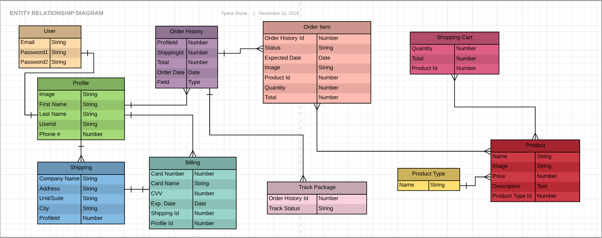

Table of Contents
<!-- TOC -->

- [NCR Silver](#ncr-silver)
- [Live Site](#live-site)
- [Assignment Page](#assignment-page)
- [UX Prototype](#ux-prototype)
- [Entity Relationship Diagram](#entity-relationship-diagram)
- [Trello](#trello)
- [Works Cited](#works-cited)
    - [Libraries Used](#libraries-used)
    - [Tools Used](#tools-used)
- [Q & A](#q--a)
    - [Who are you working for and what is the product you were asked to build?](#who-are-you-working-for-and-what-is-the-product-you-were-asked-to-build)
    - [Talk about your experience working with the UX team and an actual client and ways that it’s been different than what we’ve done in the past.](#talk-about-your-experience-working-with-the-ux-team-and-an-actual-client-and-ways-that-its-been-different-than-what-weve-done-in-the-past)
    - [Talk about how your team distributed work amongst each other, and how did you manage who was working on what?](#talk-about-how-your-team-distributed-work-amongst-each-other-and-how-did-you-manage-who-was-working-on-what)
    - [Give a demo of the product that you have built.](#give-a-demo-of-the-product-that-you-have-built)
    - [Explain thought process behind data model, design decisions, and 3rd party APIs](#explain-thought-process-behind-data-model-design-decisions-and-3rd-party-apis)
    - [Given more time, what do you have planned for version 2.0](#given-more-time-what-do-you-have-planned-for-version-20)
    - [What are your biggest wins from this project?](#what-are-your-biggest-wins-from-this-project)
    - [Shout Outs!](#shout-outs)

<!-- /TOC -->
### NCR Silver
> National Cash Register(NCR) is the original creators of the cash register. Their NCR Silver branch which is for small business companies is creating an app for businesses to buy their products. 

 

> To help small businesses we built a guided sales solution to lead them to the product best suited for them. We added a shopping cart where they can add, edit, update and delete what they wish to buy. Created easy step by step checkout for both users and guests. Added the ability to sign up and sign in to their profile. 

### Live Site
[Click Here For Site](https://ncr-silver.herokuapp.com)

### Assignment Page
[Click Here for Assignment Page](https://git.generalassemb.ly/atl-wdi/final_project_group_variant)
### UX Prototype
[Click Here for UX Prototype](https://invis.io/NPPIT2TFDYJ)
### Entity Relationship Diagram

[Full Screen ERD](https://www.lucidchart.com/invitations/accept/b2876a02-4836-4700-a857-7766026aa452)

### Trello
 [Click Here For Trello](https://trello.com/b/UzSUou6c/ncr)

<a href="#top">Back to top</a>

### Works Cited
#### Libraries Used
 | Library | Link |
| --- | --- |
| ReactStrap | [ReactStrap](https://github.com/reactstrap/reactstrap) |
| Material UI | [Material UI](https://material-ui.com/) |
| Semantic UI | [Semantic UI](https://semantic-ui.com/) |
| Font Awesome | [Font Awesome](hhttps://fontawesome.com/) |
| Pretty Checkbox | [Pretty Checkbox](https://lokesh-coder.github.io/pretty-checkbox/) |
| Fonts | [Google Fonts](https://fonts.google.com/) |

<a href="#top">Back to top</a>

#### Tools Used
 * React.js
 * Django
 * Python
 * Axios
 * Heroku
  
<a href="#top">Back to top</a>

### Q & A
#### Who are you working for and what is the product you were asked to build?
#### Talk about your experience working with the UX team and an actual client and ways that it’s been different than what we’ve done in the past.
#### Talk about how your team distributed work amongst each other, and how did you manage who was working on what?
#### Give a demo of the product that you have built.
#### Explain thought process behind data model, design decisions, and 3rd party APIs
#### Given more time, what do you have planned for version 2.0
#### What are your biggest wins from this project?
#### Shout Outs!

<a href="#top">Back to top</a> 
 
<a href="#live-site">Live Site</a>
